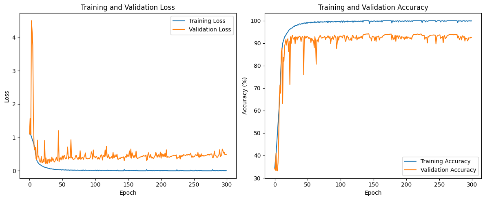
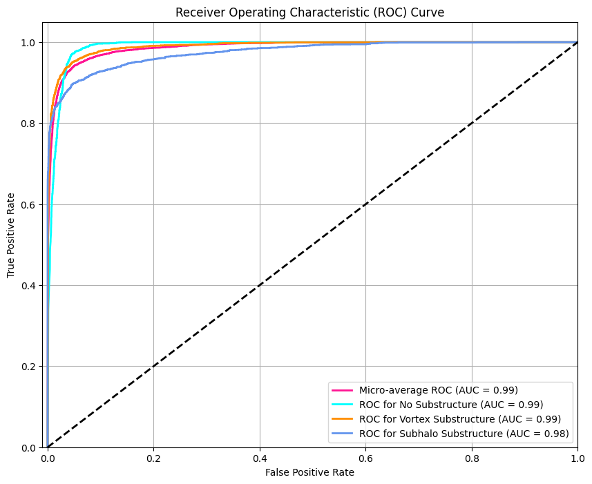
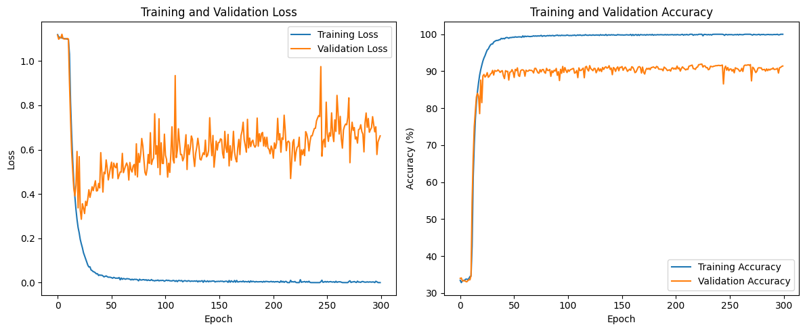
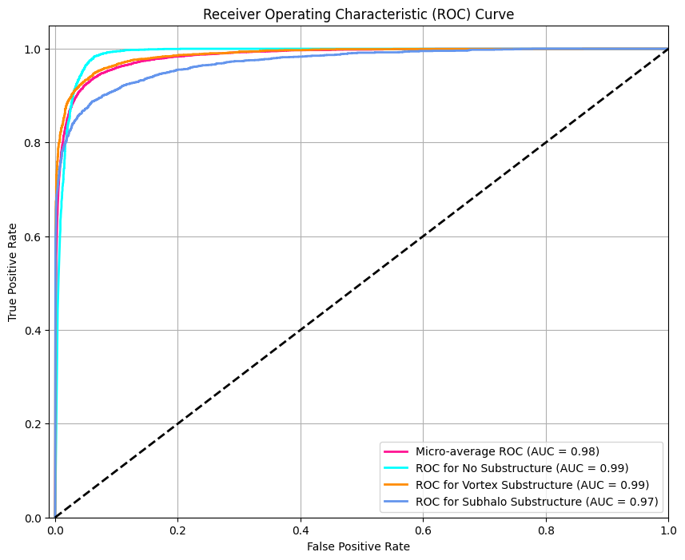
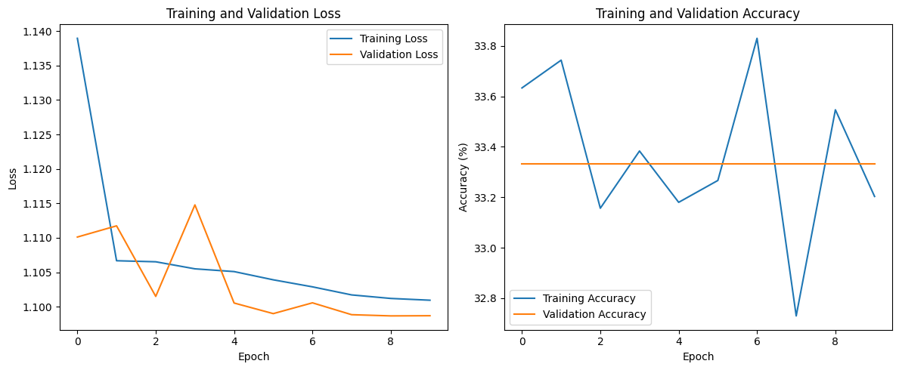
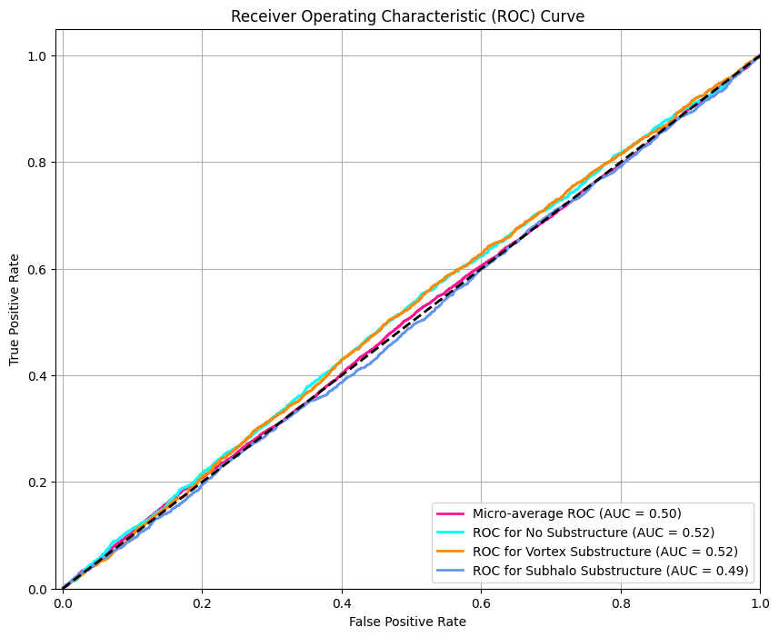
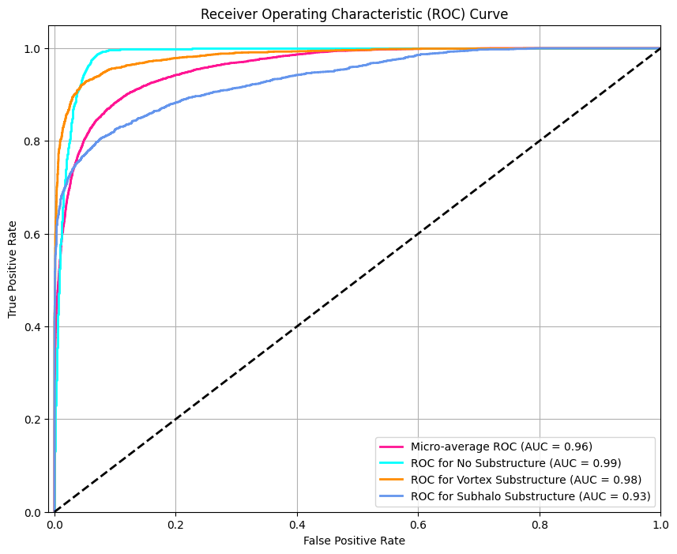
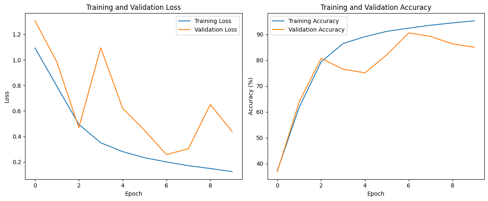

## stratergy

pretty standard.. CNN for image classification

## code

[Jupter Notebook: Code](Q1_classification.ipynb)

## final results

### Using Ensamble of models

[Kaggle Run Notebook](kaggle_run_Q1_deeplense-classification.ipynb)

- ensambling resnet18 and densenet121 (not the most ideal combination but just to try it out)





AUC Score: 0.9867628222222221


### Using Resnet18 block

`pretrained=False`

batch size = 32





`Epoch 300/300, Train Loss: 0.0000, Train Acc: 100.00%, Val Loss: 0.6623, Val Acc: 91.41%`

AUC Score: 0.9838126488888888


### using ViT block

DID NOT WORK ... ahhahaha

batch size = 128





AUC Score: 0.5030166266666667

### using resnet18 block v0





AUC Score: 0.9596819022222222

batch size = 256

```
Using device: cuda:0
Epoch 1/10, Train Loss: 1.0936, Train Acc: 37.16%, Val Loss: 1.3068, Val Acc: 36.89%
Epoch 2/10, Train Loss: 0.7929, Train Acc: 61.80%, Val Loss: 0.9827, Val Acc: 63.85%
Epoch 3/10, Train Loss: 0.4946, Train Acc: 79.37%, Val Loss: 0.4689, Val Acc: 80.73%
Epoch 4/10, Train Loss: 0.3501, Train Acc: 86.47%, Val Loss: 1.0952, Val Acc: 76.56%
Epoch 5/10, Train Loss: 0.2811, Train Acc: 89.14%, Val Loss: 0.6212, Val Acc: 75.12%
Epoch 6/10, Train Loss: 0.2329, Train Acc: 91.19%, Val Loss: 0.4476, Val Acc: 82.15%
Epoch 7/10, Train Loss: 0.1997, Train Acc: 92.44%, Val Loss: 0.2579, Val Acc: 90.60%
Epoch 8/10, Train Loss: 0.1706, Train Acc: 93.57%, Val Loss: 0.3027, Val Acc: 89.21%
Epoch 9/10, Train Loss: 0.1484, Train Acc: 94.47%, Val Loss: 0.6502, Val Acc: 86.35%
Epoch 10/10, Train Loss: 0.1241, Train Acc: 95.28%, Val Loss: 0.4387, Val Acc: 85.03%

```

