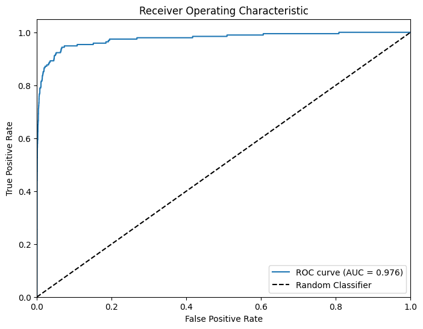

## Task Details:

**Specific Test II. Lens Finding**

**Task:** Build a model identifying lenses using **PyTorch** or **Keras**. For the training use the images in `train_lenses` and `train_nonlenses` directories, for evaluation use the images from test\_lenses and test\_nonlenses directories. Note that the number of non-lenses is much larger than the number of lensed galaxies. Pick the most appropriate approach and discuss your strategy.

**Dataset:**

[https://drive.google.com/file/d/1doUhVoq1-c9pamZVLpvjW1YRDMkKO1Q5/view?usp=drive\_link](https://drive.google.com/file/d/1doUhVoq1-c9pamZVLpvjW1YRDMkKO1Q5/view?usp=drive_link)

**Dataset Description:** A dataset comprising observational data of strong lenses and non-lensed galaxies. Images in [three different filters](https://skyserver.sdss.org/dr1/en/proj/advanced/color/sdssfilters.asp) are available for each object, so the shape of each object array is (3, 64, 64). Lensed objects are placed in the directory `train_lenses` and `test_lenses`, non-lensed galaxies are in `train_nonlenses` and `test_nonlenses`.

**Evaluation Metrics:** ROC curve (Receiver Operating Characteristic curve) and AUC score (Area Under the ROC Curve) 

---

## Stratergy

I've taken a pretty straightforward approach here. I built a custom PyTorch dataset to load our npy image files for lensed and non-lensed galaxies, which keeps things neat since each image is already shaped as (3, 64, 64). Because the non-lensed class is way more common, I used a weighted sampler so that the model sees more examples of the rare, lensed galaxies. The model itself is a CNN with a few convolutional layers and fully connected layers, ending with one output neuron (that gets passed through a sigmoid). I then evaluate the model using the ROC curve and AUC score, focusing on the positive class (lensed galaxies) since that's our main interest. Overall, it's a straightforward strategy that works well for this imbalanced dataset.

## Results

AUC Score: 0.9762439291197965 

The loss is still decreasing and hasn't saturated so still room for better performance (can add more params to the model as well)