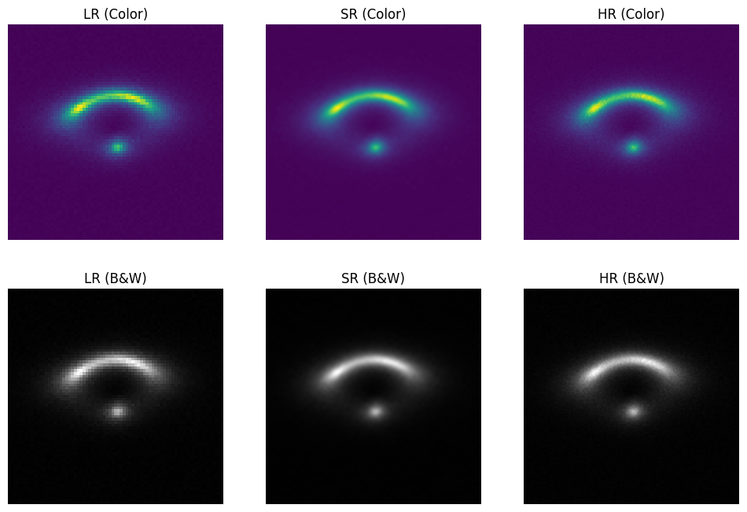

## Task Details:

**Specific Test III. Image Super-resolution** 

**Task III.A:** Train a deep learning-based super resolution algorithm of your choice to upscale low-resolution strong lensing images using the provided high-resolution samples as ground truths. Please implement your approach in **PyTorch** or **Keras** and discuss your strategy.

**Dataset:** [https://drive.google.com/file/d/1uJmDZw649XS-r-dYs9WD-OPwF\_TIroVw/view?usp=sharing](https://drive.google.com/file/d/1uJmDZw649XS-r-dYs9WD-OPwF_TIroVw/view?usp=sharing)

**Dataset Description:** The dataset comprises simulated strong lensing images with no substructure at multiple resolutions: high-resolution (HR) and low-resolution (LR).

**Evaluation Metrics:** MSE (Mean Squared Error), SSIM (Structural Similarity Index), PSNR (Peak Signal-to-Noise Ratio)

**Task III.B:** Train a deep learning-based super-resolution algorithm of your choice to enhance low-resolution strong lensing images using a limited dataset of real HR/LR pairs collected from HSC and HST telescopes. You can adapt and fine-tune your super-resolution model from Task III.A. or use any other approach, such as few-shot learning strategies, transfer learning, domain adaptation, or data augmentation techniques, etc. Please implement your approach in **PyTorch** or **Keras** and discuss your strategy.

**Dataset:** [https://drive.google.com/file/d/1plYfM-jFJT7TbTMVssuCCFvLzGdxMQ4h/view?usp=sharing](https://drive.google.com/file/d/1plYfM-jFJT7TbTMVssuCCFvLzGdxMQ4h/view?usp=sharing)

**Dataset Description:** The dataset comprises 300 strong lensing image pairs at multiple resolutions: high-resolution (HR) and low-resolution (LR).

**Evaluation Metrics:** MSE (Mean Squared Error), SSIM (Structural Similarity Index), PSNR (Peak Signal-to-Noise Ratio)


---
## stratergy

i went with a pretty straightforward strategy. for both tasks, the idea was to use a simple SRCNN-style model that first upscales the low-resolution image with bicubic interpolation and then refines it using a few convolutional layers. made a 90:10 split for the dataset as given in the instructions.

in Task III.A, the model is trained from scratch on simulated data, using the HR images as the ground truth with MSE loss.

for III B. : 
i decided to try transfer learning approach since the real dataset is limited. by starting with a model pretrained on the large data, we take advantage of the robust features already learned. then, by freezing the early layers (which tend to capture generic image features) and fine-tuning only the later layer(s), we adapt the model to the specific characteristics of the real strong lensing images. 
probably finetuning the entire model could work better... 

and from testing seems to work better, as expected but then again its performance on original data is not the best.. essentially at that point for these many epochs its like training it from scratch


## results

#### 3A. 

```
Evaluating on train set:
Average MSE: 0.000068
Average PSNR: 41.67 dB
Average SSIM: 0.9741


Evaluating on val set:
Average MSE: 0.000068
Average PSNR: 41.65 dB
Average SSIM: 0.9740
```





#### 3B.

```
Evaluating on train set:
Average MSE: 0.001355
Average PSNR: 28.68 dB
Average SSIM: 0.8092


Evaluating on val set:
Average MSE: 0.000862
Average PSNR: 30.65 dB
Average SSIM: 0.8495
```


These need some work, current stratergy isn't working too well, might use some better stratergy.. complete finetune instead of just last few layers?


#### 3B (update using finetune of all param):

```
Evaluating on train set:
Average MSE: 0.001355
Average PSNR: 28.68 dB
Average SSIM: 0.8092


Evaluating on val set:
Average MSE: 0.000862
Average PSNR: 30.65 dB
Average SSIM: 0.8495
```

welp :/ no performance change at all... too less param in the model... time for a more param architecture

TODO: increase no of params
TODO: add better visualization
TODO: 

## helpful resources

https://medium.com/coinmonks/review-srcnn-super-resolution-3cb3a4f67a7c

https://github.com/kunal-visoulia/Image-Restoration-using-SRCNN

https://arxiv.org/abs/1501.00092
