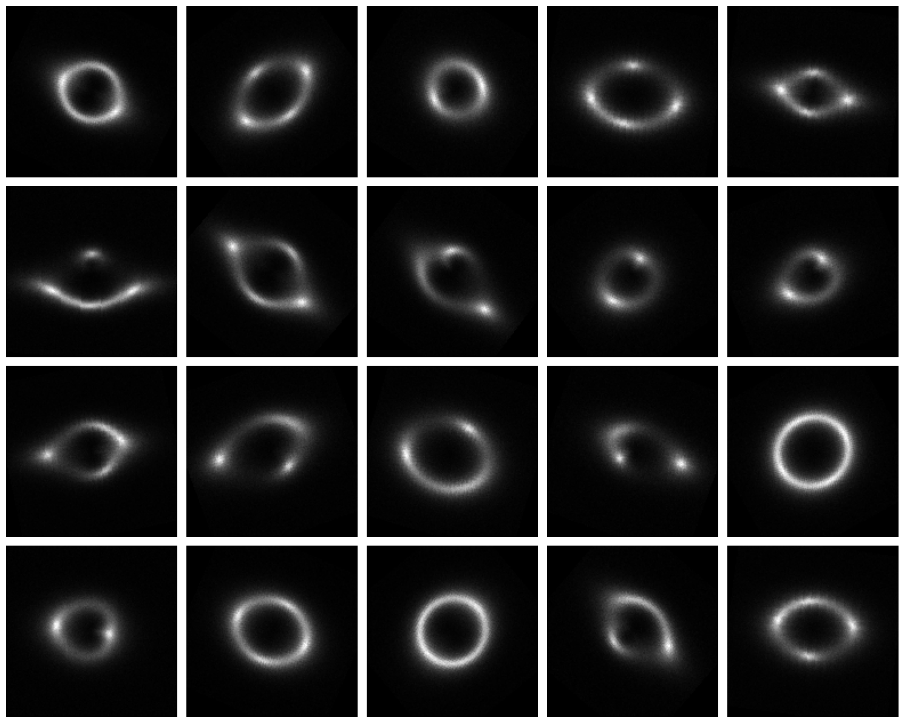
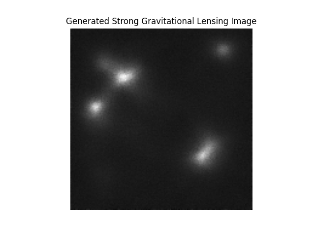
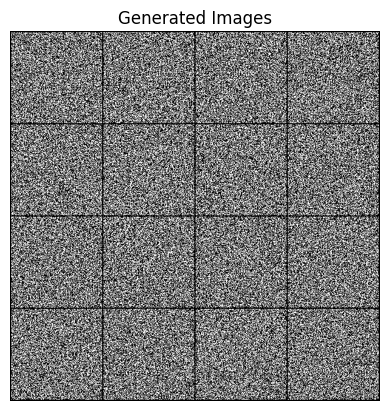
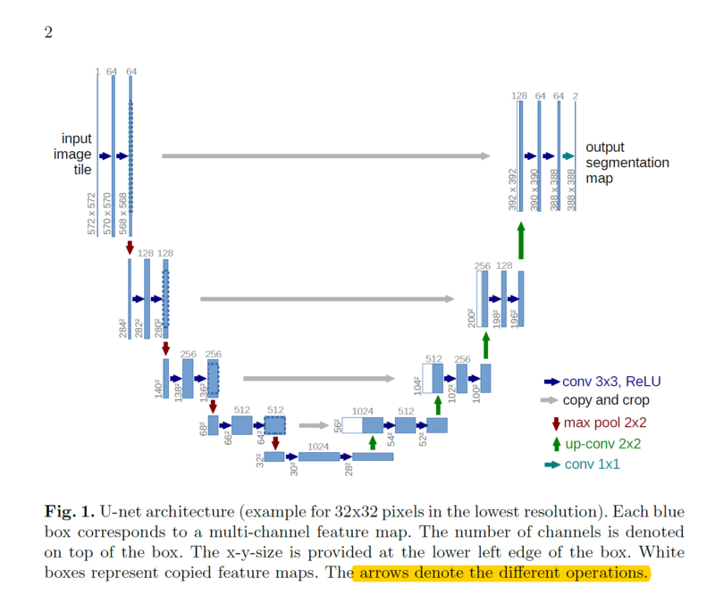

Not working .. just black images being generated not sure why...
loss is decreasing still it doesnt seem to be doing antyhing, i suspect some channel issue but couldnt find the bug

## results

Trying with modified architecture thanks to vid by umar jamil [new code v1](2code.py)

After a very short run (10 epochs) using batch size of 16 got it to generate something:

It atleast is now generating something rather than original garbage:

## good resources

Video by Umar Jamil: https://www.youtube.com/watch?v=I1sPXkm2NH4

DDPM paper: https://arxiv.org/abs/2006.11239

Explanation: https://medium.com/@kemalpiro/step-by-step-visual-introduction-to-diffusion-models-235942d2f15c

https://towardsdatascience.com/diffusion-model-from-scratch-in-pytorch-ddpm-9d9760528946/

Coding resources:

https://github.com/quickgrid/paper-implementations/tree/main/pytorch/ddpm (annotated DDPM implementation)

https://github.com/filipbasara0/simple-diffusion/tree/main

https://github.com/ML4SCI/DeepLense/tree/main/DeepLense_Diffusion_Rishi

