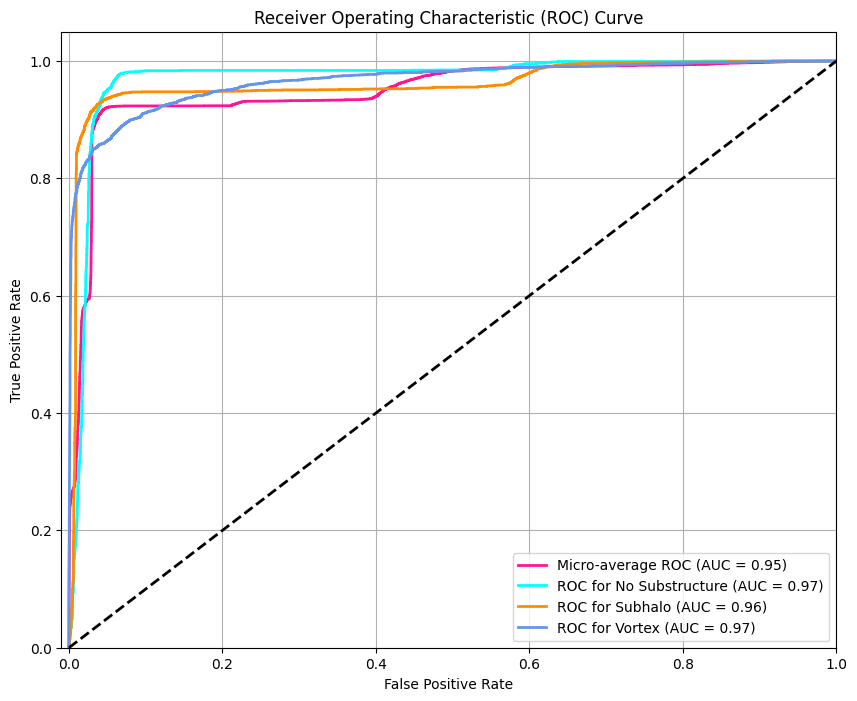
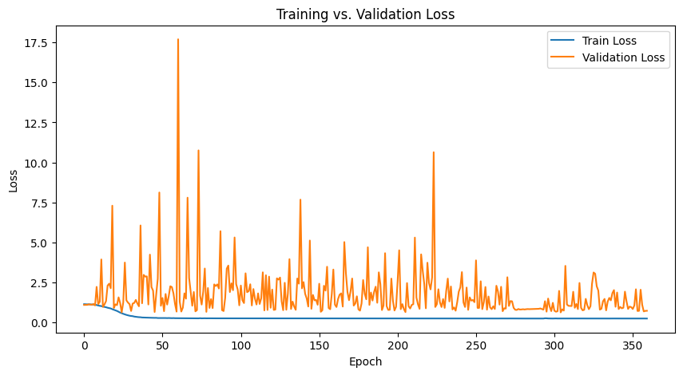
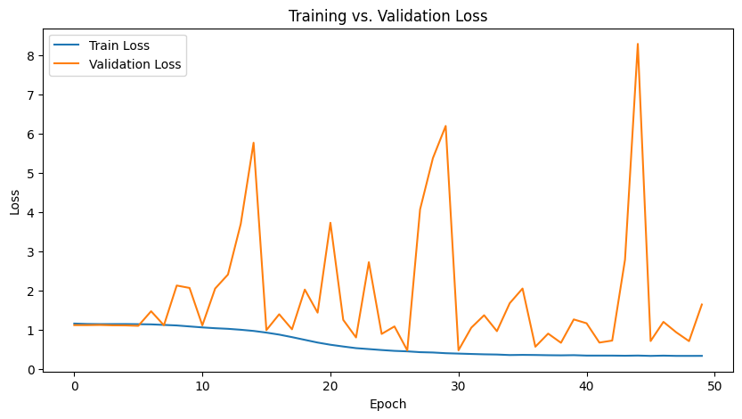
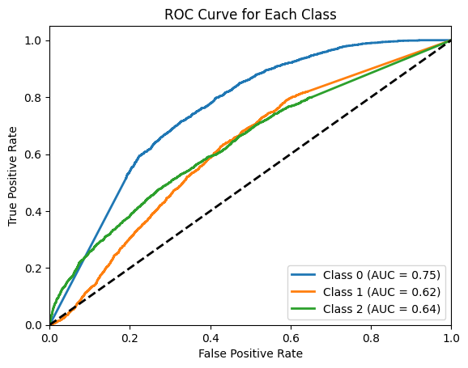

## results

#### new PINN (longer run)

[Notebook](2_kaggle_PINN_classification_deeplense.ipynb)

360 epochs

completely useless, there are other model problems but such brute forcing works?!... still model needs some fixing as val loss is fluctuating way too much current split has some issue or some issue is definitely there



```
Epoch 360/360
Val Loss: 0.7353, Accuracy: 0.9141
Train Loss: 0.250860 | Val Loss: 0.735333 | LR: 0.000400
```




#### new PINN

using gravitational lensing equation





#### physics informed


using einstein radius as physics informed loss (kinda weird, havent understood what PINN does very nicely)

```
Class 0 AUC: 0.7535
Class 1 AUC: 0.6159
Class 2 AUC: 0.6376
```

