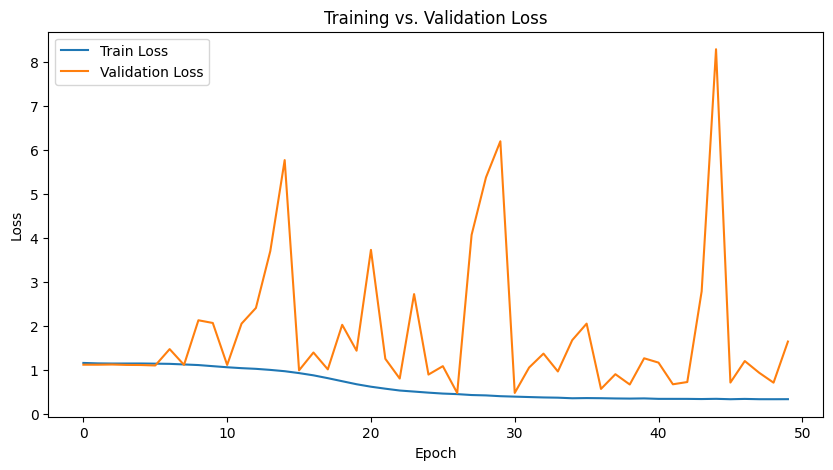
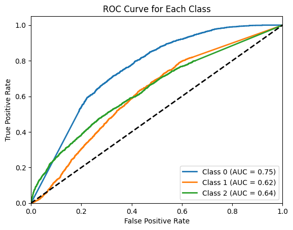

## new PINN

using gravitational lensing equation





## physics informed


using einstein radius as physics informed loss (kinda weird, havent understood what PINN does very nicely)

```
Class 0 AUC: 0.7535
Class 1 AUC: 0.6159
Class 2 AUC: 0.6376
```

