## Task Details:

**Specific Test VI. Foundation Model** 

**Task VI.A:** Train a [Masked Autoencoder (MAE)](https://arxiv.org/abs/2111.06377) on the no_sub samples from the provided dataset to learn a feature representation of strong lensing images. The MAE should be trained for reconstructing masked portions of input images. Once this pre-training phase is complete, fine-tune the model on the full dataset for a multi-class classification task to distinguish between the three classes. Please implement your approach in **PyTorch** or **Keras** and discuss your strategy.

**Dataset:** [https://drive.google.com/file/d/1znqUeFzYz-DeAE3dYXD17qoMPK82Whji/view?usp=sharing](https://drive.google.com/file/d/1znqUeFzYz-DeAE3dYXD17qoMPK82Whji/view?usp=sharing)

**Dataset Description:** The Dataset consists of three classes: no_sub (no substructure), cdm (cold dark matter substructure), and axion (axion-like particle substructure).

**Evaluation Metrics:** ROC curve (Receiver Operating Characteristic curve) and AUC score (Area Under the ROC Curve) 

**Task VI.B:** Take the pre-trained model from Task VI.A and fine-tune it for a super-resolution task. The model should be fine-tuned to upscale low-resolution strong lensing images using the provided high-resolution samples as ground truths. Please implement your approach in **PyTorch** or **Keras** and discuss your strategy.

**Dataset:** [https://drive.google.com/file/d/1uJmDZw649XS-r-dYs9WD-OPwF_TIroVw/view?usp=sharing](https://drive.google.com/file/d/1uJmDZw649XS-r-dYs9WD-OPwF_TIroVw/view?usp=sharing)

**Dataset Description:** The dataset comprises simulated strong lensing images with no substructure at multiple resolutions: high-resolution (HR) and low-resolution (LR).

---

## Results v4


## Results v3

[Weights](results_2)

[Notebook](2_deeplense-foundation-model.ipynb)

Changes for here: latent dim = 512

## Results v2

[Weights](weights_1)

[Notebook](1_deeplense-foundation-model.ipynb)

50 epochs each

also added Auto Masked Autoencoder... essentially automatically applies the mask it seems best

[Paper](https://arxiv.org/html/2303.06583v2)

#### MAE

[MAE Pretraining] Epoch [50/50], Loss: 0.000458

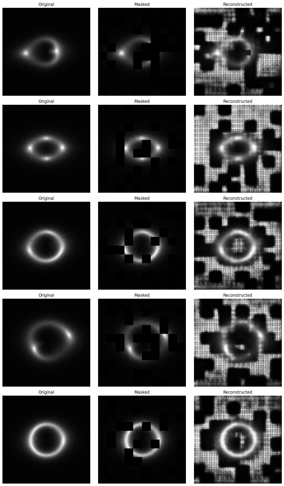


##### Classification

[Classifier] Epoch [28/50], Train Loss: 0.6245, Train Acc: 71.85%, Val Loss: 1.8388, Val Acc: 47.16%, ROC AUC: 0.7429  
Early stopping triggered after 28 epochs  
Loaded best model with AUC: 0.7645
```
AUC Scores:
------------------------------
Class      | AUC Score 
------------------------------
0          | 0.8311
1          | 0.6515
2          | 0.7460
------------------------------
Micro-avg  | 0.6735
Macro-avg  | 0.7429
```
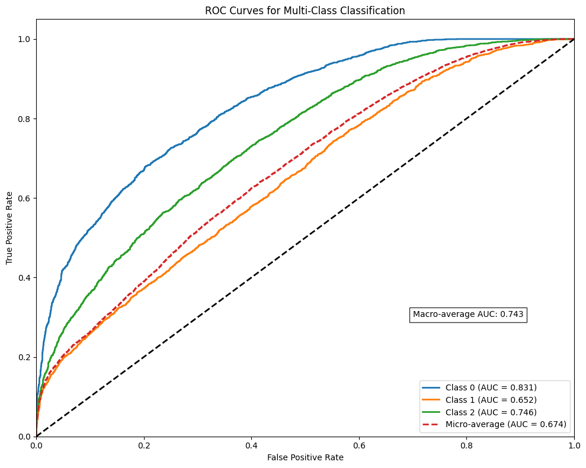

[Classifier] Epoch [36/50], Train Loss: 0.0142, Train Acc: 99.66%, Val Loss: 0.4523, Val Acc: 88.17%, ROC AUC: 0.9699  
Early stopping triggered after 36 epochs  
Loaded best model with AUC: 0.9705

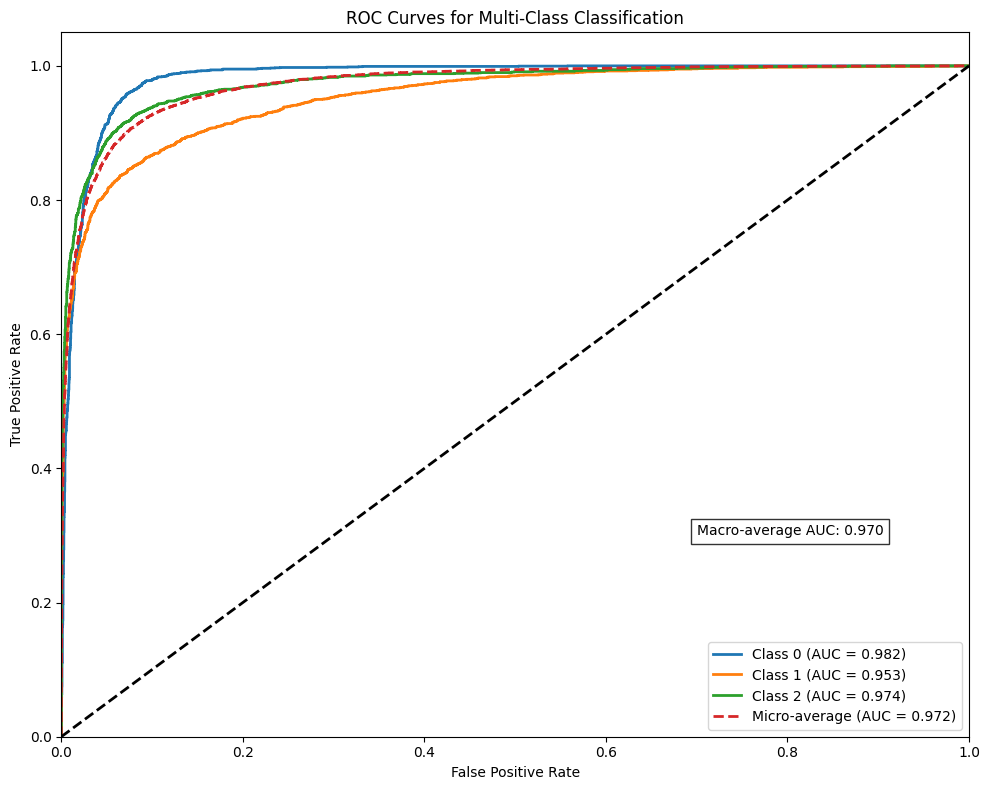
```
AUC Scores:
------------------------------
Class      | AUC Score 
------------------------------
0          | 0.9824
1          | 0.9532
2          | 0.9740
------------------------------
Micro-avg  | 0.9717
Macro-avg  | 0.9699
```


#### Auto MAE

[AutoMAE] Epoch [50/50], Recon Loss: 0.000490, Mask Loss: -0.000049, Total Loss: -0.000049, Mode: Mask Update

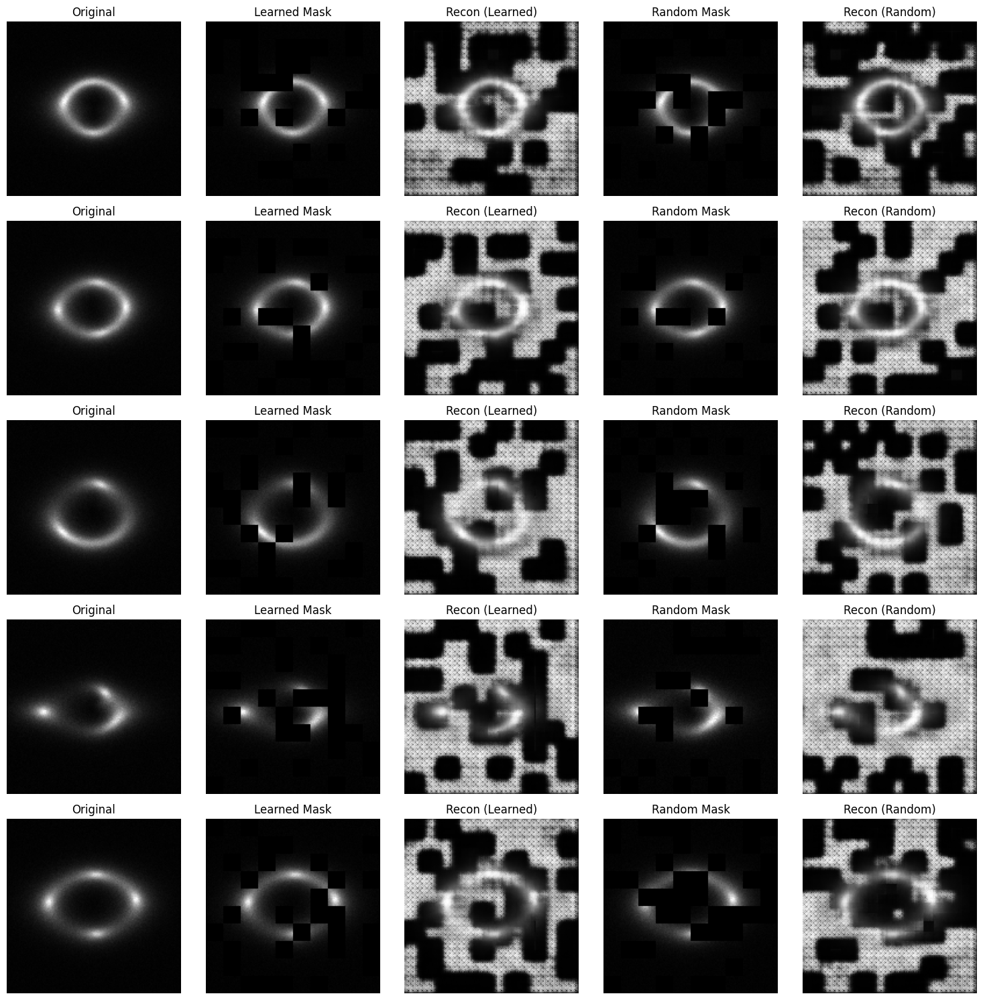

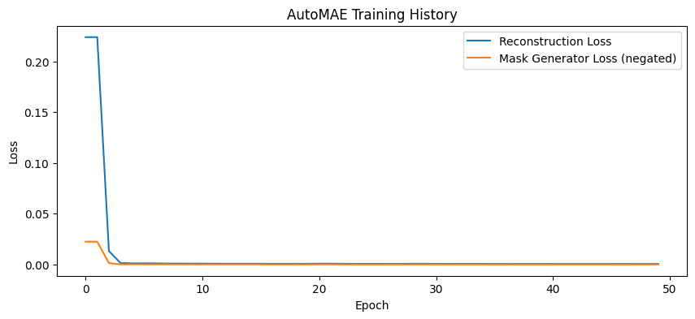

#### Classification with automae encoder

[Classifier] Epoch [18/50], Train Loss: 0.8449, Train Acc: 58.00%, Val Loss: 1.1180, Val Acc: 44.00%, ROC AUC: 0.6685  
Early stopping triggered after 18 epochs  
Loaded best model with AUC: 0.6934

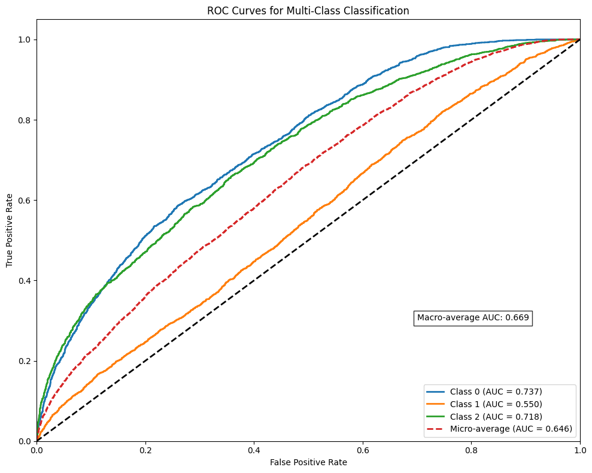

```
AUC Scores:
------------------------------
Class      | AUC Score 
------------------------------
0          | 0.7374
1          | 0.5498
2          | 0.7184
------------------------------
Micro-avg  | 0.6457
Macro-avg  | 0.6685
```
Fine-tuning the entire model...

[Classifier] Epoch [21/50], Train Loss: 0.2453, Train Acc: 90.67%, Val Loss: 1.5103, Val Acc: 52.24%, ROC AUC: 0.8986  
Early stopping triggered after 21 epochs  
Loaded best model with AUC: 0.9321

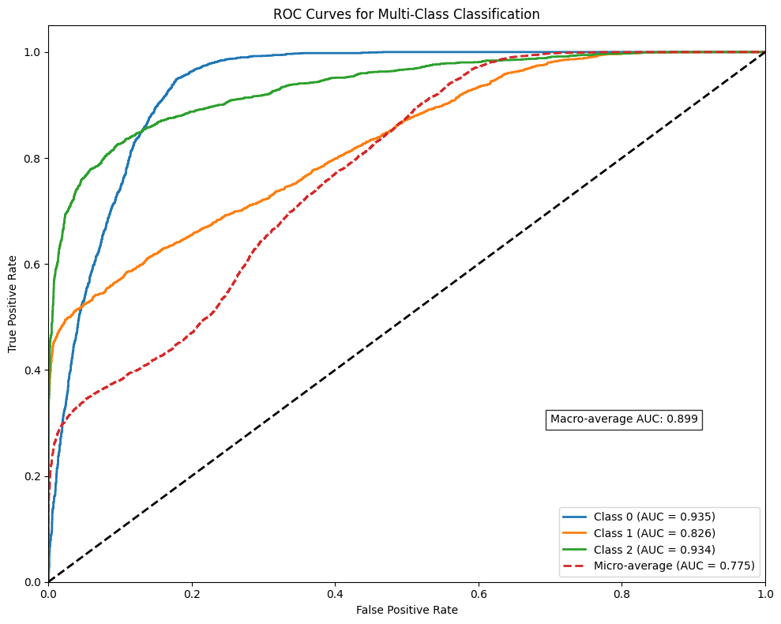

```
AUC Scores:
------------------------------
Class      | AUC Score 
------------------------------
0          | 0.9350
1          | 0.8264
2          | 0.9345
------------------------------
Micro-avg  | 0.7753
Macro-avg  | 0.8986
```

#### SuperResolution

[Super-Resolution] Epoch [50/50], MSE Loss: 0.000093, L1 Loss: 0.005871, Total Loss: 0.003028, PSNR: 40.32 dB

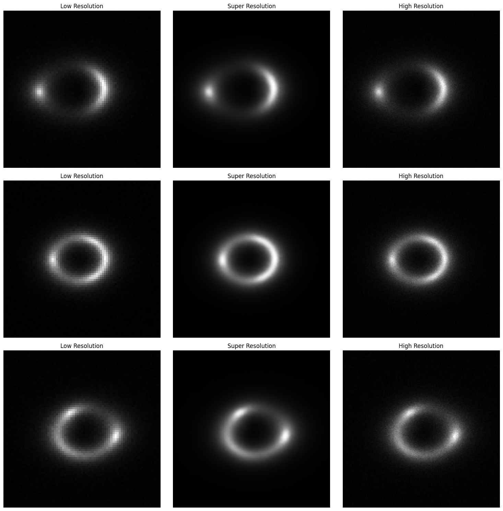

---

## Results v1:

`[MAE Pretraining] Epoch [50/50], Loss: 0.000390`

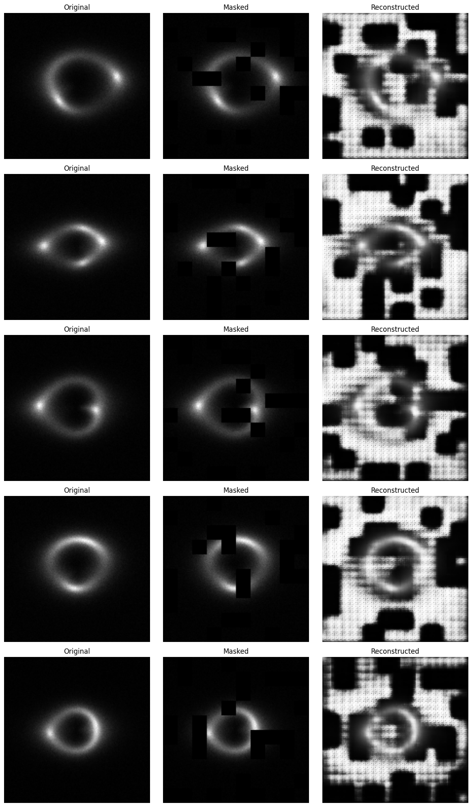

```
[Classifier] Epoch [31/50], Train Loss: 0.5620, Train Acc: 75.14%, Val Loss: 0.9332, Val Acc: 61.07%, ROC AUC: 0.8208
Early stopping triggered after 31 epochs
Loaded best model with AUC: 0.8222
Fine-tuning the entire model...
...
...
[Classifier] Epoch [50/50], Train Loss: 0.0035, Train Acc: 99.97%, Val Loss: 0.4713, Val Acc: 88.88%, ROC AUC: 0.9700
```
`Loaded best model with AUC: 0.9700`


`[Super-Resolution] Epoch [50/50], MSE Loss: 0.000093, L1 Loss: 0.005868, Total Loss: 0.003027, PSNR: 40.34 dB`

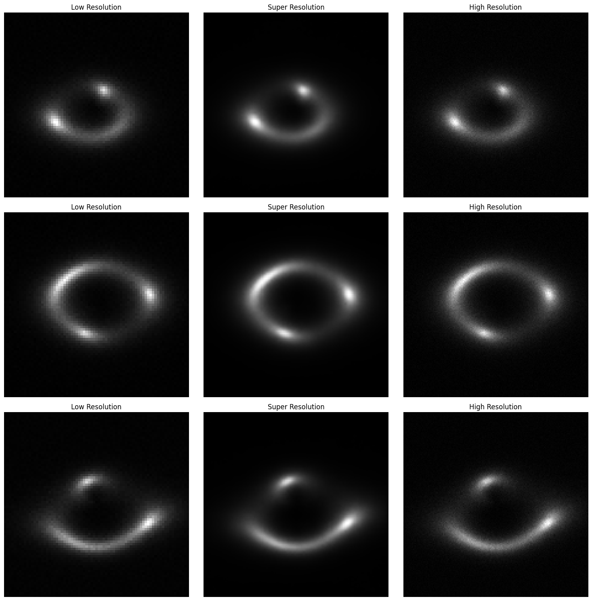


## Results run 1:

[Weights](weights_old)

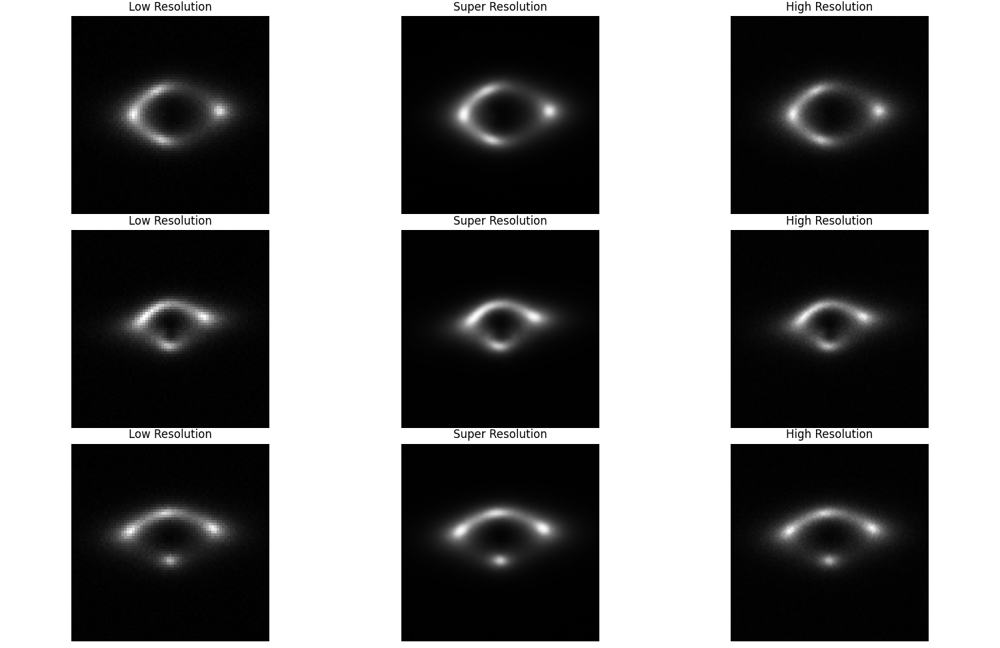


## Results run 2:

```
Starting MAE pretraining...
[MAE Pretraining] Epoch [1/15], Loss: 0.011835
[MAE Pretraining] Epoch [2/15], Loss: 0.001353
[MAE Pretraining] Epoch [3/15], Loss: 0.001058
[MAE Pretraining] Epoch [4/15], Loss: 0.000897
[MAE Pretraining] Epoch [5/15], Loss: 0.000846
[MAE Pretraining] Epoch [6/15], Loss: 0.000799
[MAE Pretraining] Epoch [7/15], Loss: 0.000757
[MAE Pretraining] Epoch [8/15], Loss: 0.000712
[MAE Pretraining] Epoch [9/15], Loss: 0.000710
[MAE Pretraining] Epoch [10/15], Loss: 0.000642
[MAE Pretraining] Epoch [11/15], Loss: 0.000654
[MAE Pretraining] Epoch [12/15], Loss: 0.000618
[MAE Pretraining] Epoch [13/15], Loss: 0.000596
[MAE Pretraining] Epoch [14/15], Loss: 0.000608
[MAE Pretraining] Epoch [15/15], Loss: 0.000587


Starting classifier fine-tuning with frozen encoder...

[Classifier] Epoch [1/15], Train Loss: 1.1103, Train Acc: 33.48%, Val Loss: 1.1007, Val Acc: 34.29%, ROC AUC: 0.5148
[Classifier] Epoch [2/15], Train Loss: 1.1039, Train Acc: 34.65%, Val Loss: 1.0973, Val Acc: 36.21%, ROC AUC: 0.5338
[Classifier] Epoch [3/15], Train Loss: 1.0955, Train Acc: 36.81%, Val Loss: 1.1026, Val Acc: 36.35%, ROC AUC: 0.5340
[Classifier] Epoch [4/15], Train Loss: 1.0860, Train Acc: 38.42%, Val Loss: 1.1135, Val Acc: 36.55%, ROC AUC: 0.5769
[Classifier] Epoch [5/15], Train Loss: 1.0710, Train Acc: 40.95%, Val Loss: 1.1244, Val Acc: 37.05%, ROC AUC: 0.5727
[Classifier] Epoch [6/15], Train Loss: 1.0552, Train Acc: 42.27%, Val Loss: 1.2279, Val Acc: 34.64%, ROC AUC: 0.5441
[Classifier] Epoch [7/15], Train Loss: 1.0364, Train Acc: 44.56%, Val Loss: 1.1293, Val Acc: 36.40%, ROC AUC: 0.6026
[Classifier] Epoch [8/15], Train Loss: 1.0200, Train Acc: 45.61%, Val Loss: 1.2413, Val Acc: 35.92%, ROC AUC: 0.5785
[Classifier] Epoch [9/15], Train Loss: 1.0082, Train Acc: 47.05%, Val Loss: 1.7455, Val Acc: 34.16%, ROC AUC: 0.5709
[Classifier] Epoch [10/15], Train Loss: 0.9858, Train Acc: 48.78%, Val Loss: 1.1523, Val Acc: 35.99%, ROC AUC: 0.6036
[Classifier] Epoch [11/15], Train Loss: 0.9748, Train Acc: 49.65%, Val Loss: 1.7932, Val Acc: 34.77%, ROC AUC: 0.5662
[Classifier] Epoch [12/15], Train Loss: 0.9631, Train Acc: 50.40%, Val Loss: 0.9814, Val Acc: 48.64%, ROC AUC: 0.6801
[Classifier] Epoch [13/15], Train Loss: 0.9495, Train Acc: 51.46%, Val Loss: 1.5599, Val Acc: 33.52%, ROC AUC: 0.5878
[Classifier] Epoch [14/15], Train Loss: 0.9361, Train Acc: 52.82%, Val Loss: 1.4661, Val Acc: 34.45%, ROC AUC: 0.6274
[Classifier] Epoch [15/15], Train Loss: 0.9254, Train Acc: 53.14%, Val Loss: 1.3361, Val Acc: 40.89%, ROC AUC: 0.6347
Loaded best model with AUC: 0.6801

Fine-tuning the entire model...

[Classifier] Epoch [1/20], Train Loss: 1.0204, Train Acc: 46.06%, Val Loss: 1.4637, Val Acc: 33.41%, ROC AUC: 0.5497
[Classifier] Epoch [2/20], Train Loss: 0.9772, Train Acc: 49.25%, Val Loss: 1.2137, Val Acc: 35.84%, ROC AUC: 0.6551
[Classifier] Epoch [3/20], Train Loss: 0.9477, Train Acc: 51.57%, Val Loss: 1.2631, Val Acc: 36.49%, ROC AUC: 0.6252
[Classifier] Epoch [4/20], Train Loss: 0.9259, Train Acc: 53.42%, Val Loss: 1.0121, Val Acc: 46.96%, ROC AUC: 0.6876
[Classifier] Epoch [5/20], Train Loss: 0.9037, Train Acc: 54.81%, Val Loss: 2.5145, Val Acc: 33.52%, ROC AUC: 0.6225
[Classifier] Epoch [6/20], Train Loss: 0.8696, Train Acc: 57.17%, Val Loss: 1.0629, Val Acc: 41.77%, ROC AUC: 0.6819
[Classifier] Epoch [7/20], Train Loss: 0.8377, Train Acc: 59.39%, Val Loss: 0.9928, Val Acc: 48.05%, ROC AUC: 0.7449
[Classifier] Epoch [8/20], Train Loss: 0.7917, Train Acc: 62.71%, Val Loss: 3.8323, Val Acc: 33.33%, ROC AUC: 0.6563
[Classifier] Epoch [9/20], Train Loss: 0.7653, Train Acc: 63.97%, Val Loss: 2.8702, Val Acc: 33.36%, ROC AUC: 0.6551
[Classifier] Epoch [10/20], Train Loss: 0.7285, Train Acc: 66.53%, Val Loss: 1.1678, Val Acc: 52.73%, ROC AUC: 0.7633
[Classifier] Epoch [11/20], Train Loss: 0.6826, Train Acc: 68.95%, Val Loss: 1.1298, Val Acc: 50.17%, ROC AUC: 0.7739
[Classifier] Epoch [12/20], Train Loss: 0.6482, Train Acc: 70.97%, Val Loss: 6.1057, Val Acc: 33.33%, ROC AUC: 0.6346
[Classifier] Epoch [13/20], Train Loss: 0.6172, Train Acc: 72.98%, Val Loss: 3.4597, Val Acc: 39.07%, ROC AUC: 0.7454
[Classifier] Epoch [14/20], Train Loss: 0.5887, Train Acc: 74.27%, Val Loss: 1.3394, Val Acc: 56.21%, ROC AUC: 0.8171
[Classifier] Epoch [15/20], Train Loss: 0.5436, Train Acc: 76.73%, Val Loss: 0.7484, Val Acc: 67.19%, ROC AUC: 0.8749
[Classifier] Epoch [16/20], Train Loss: 0.5146, Train Acc: 78.42%, Val Loss: 0.6555, Val Acc: 71.09%, ROC AUC: 0.8989
[Classifier] Epoch [17/20], Train Loss: 0.4854, Train Acc: 79.96%, Val Loss: 0.8320, Val Acc: 67.01%, ROC AUC: 0.8730
[Classifier] Epoch [18/20], Train Loss: 0.4530, Train Acc: 81.37%, Val Loss: 1.0661, Val Acc: 68.68%, ROC AUC: 0.8808
[Classifier] Epoch [19/20], Train Loss: 0.4234, Train Acc: 82.88%, Val Loss: 1.7569, Val Acc: 58.41%, ROC AUC: 0.8460
[Classifier] Epoch [20/20], Train Loss: 0.3904, Train Acc: 84.44%, Val Loss: 1.8642, Val Acc: 36.88%, ROC AUC: 0.7916
Loaded best model with AUC: 0.8989

Starting super-resolution fine-tuning...
[Super-Resolution] Epoch [1/20], MSE Loss: 0.041433, L1 Loss: 0.160272, Total Loss: 0.121569, PSNR: 13.83 dB
[Super-Resolution] Epoch [2/20], MSE Loss: 0.000602, L1 Loss: 0.017714, Total Loss: 0.009459, PSNR: 32.20 dB
[Super-Resolution] Epoch [3/20], MSE Loss: 0.000176, L1 Loss: 0.007378, Total Loss: 0.003865, PSNR: 37.55 dB
[Super-Resolution] Epoch [4/20], MSE Loss: 0.000136, L1 Loss: 0.006575, Total Loss: 0.003424, PSNR: 38.65 dB
[Super-Resolution] Epoch [5/20], MSE Loss: 0.000129, L1 Loss: 0.006470, Total Loss: 0.003365, PSNR: 38.88 dB
[Super-Resolution] Epoch [6/20], MSE Loss: 0.000121, L1 Loss: 0.006340, Total Loss: 0.003292, PSNR: 39.16 dB
[Super-Resolution] Epoch [7/20], MSE Loss: 0.000114, L1 Loss: 0.006215, Total Loss: 0.003221, PSNR: 39.45 dB
[Super-Resolution] Epoch [8/20], MSE Loss: 0.000110, L1 Loss: 0.006147, Total Loss: 0.003183, PSNR: 39.60 dB
[Super-Resolution] Epoch [9/20], MSE Loss: 0.000109, L1 Loss: 0.006148, Total Loss: 0.003184, PSNR: 39.61 dB
[Super-Resolution] Epoch [10/20], MSE Loss: 0.000105, L1 Loss: 0.006070, Total Loss: 0.003140, PSNR: 39.78 dB
[Super-Resolution] Epoch [11/20], MSE Loss: 0.000106, L1 Loss: 0.006084, Total Loss: 0.003147, PSNR: 39.76 dB
[Super-Resolution] Epoch [12/20], MSE Loss: 0.000105, L1 Loss: 0.006066, Total Loss: 0.003138, PSNR: 39.81 dB
[Super-Resolution] Epoch [13/20], MSE Loss: 0.000102, L1 Loss: 0.006015, Total Loss: 0.003109, PSNR: 39.93 dB
[Super-Resolution] Epoch [14/20], MSE Loss: 0.000102, L1 Loss: 0.006017, Total Loss: 0.003110, PSNR: 39.93 dB
[Super-Resolution] Epoch [15/20], MSE Loss: 0.000102, L1 Loss: 0.006031, Total Loss: 0.003118, PSNR: 39.90 dB
[Super-Resolution] Epoch [16/20], MSE Loss: 0.000102, L1 Loss: 0.006017, Total Loss: 0.003110, PSNR: 39.92 dB
[Super-Resolution] Epoch [17/20], MSE Loss: 0.000101, L1 Loss: 0.005999, Total Loss: 0.003101, PSNR: 39.97 dB
[Super-Resolution] Epoch [18/20], MSE Loss: 0.000100, L1 Loss: 0.005986, Total Loss: 0.003093, PSNR: 40.01 dB
[Super-Resolution] Epoch [19/20], MSE Loss: 0.000100, L1 Loss: 0.005987, Total Loss: 0.003093, PSNR: 40.01 dB
[Super-Resolution] Epoch [20/20], MSE Loss: 0.000099, L1 Loss: 0.005977, Total Loss: 0.003088, PSNR: 40.02 dB


```

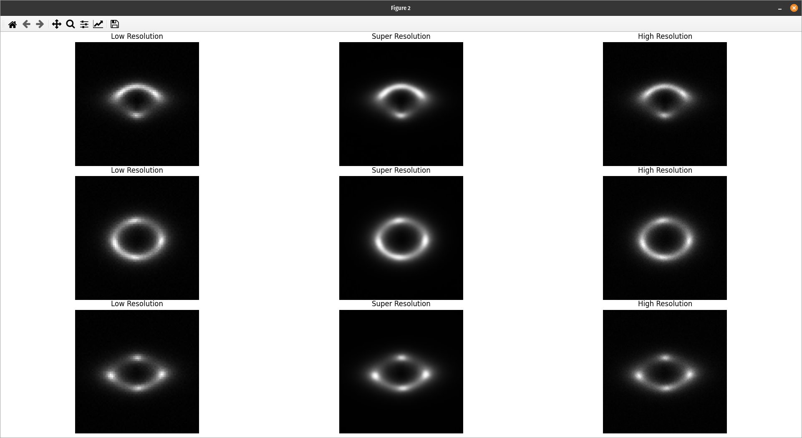
